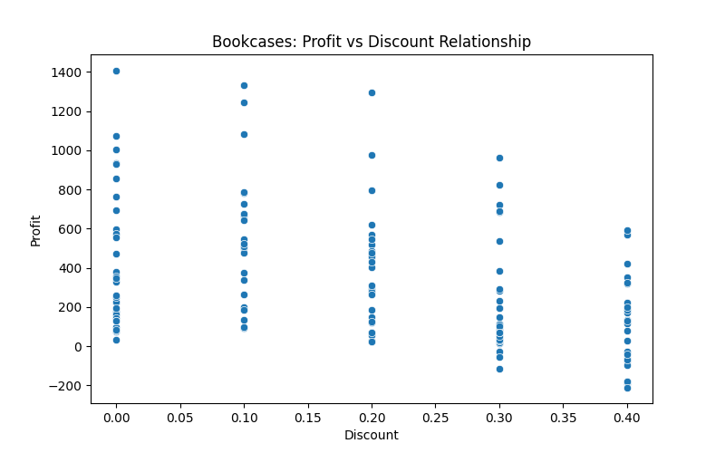
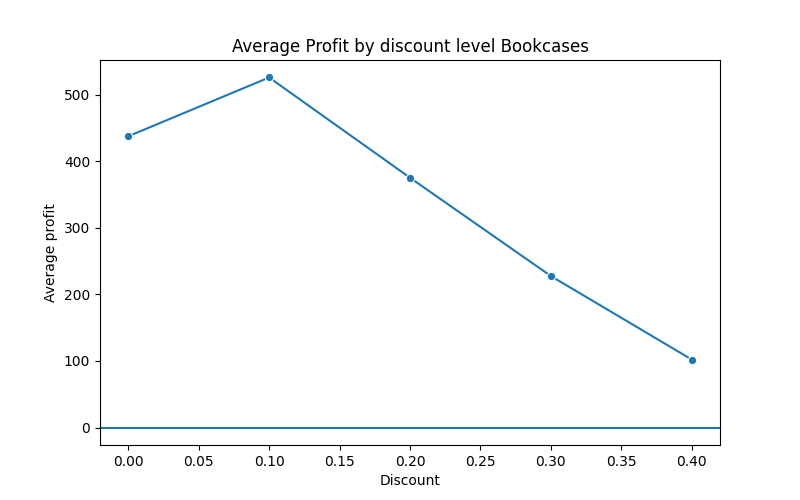
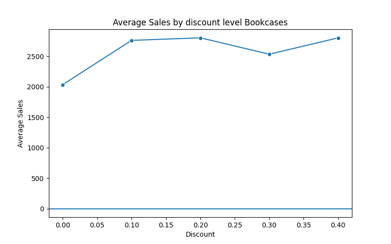

# 🛒 Superstore Sales Analysis (Business Case Study)

## 📌 Project Overview
This project analyzes a retail Superstore dataset to identify business performance issues and provide data-driven recommendations.

The goal is not only to analyze sales but to understand profitability and uncover the real reason behind low-performing product categories.

## 🎯 Business Problem
The company observed that the **Furniture category** was generating significant revenue but contributing relatively low profit.

The objective was to determine:
- Which product is responsible
- Why profitability is low
- What business action should be taken

## 🧠 Key Findings

After detailed analysis:

- Bookcases have the lowest profit margin within Furniture
- Bookcases receive higher discounts
- Some transactions are loss-making
- Higher discounts do NOT significantly increase sales

Therefore, the issue is not low demand but an ineffective discount strategy.

## 📊 Visual Analysis

### Profit vs Discount (Order Level)
Shows that high discounts often lead to loss-making orders.

---

### Average Profit by Discount Level
Identifies a risk threshold around 25–30% discount.

---

### Sales vs Discount
Shows that increasing discount does not significantly increase demand.

---

## 💡 Final Conclusion
The Bookcases sub-category is underperforming not because customers are unwilling to buy, but because the company is over-discounting the product.

The business is sacrificing profitability without meaningful sales growth.

---

## 📈 Business Recommendations

- Limit Bookcase discounts to below 25%
- Improve pricing strategy
- Bundle Bookcases with complementary products
- Reduce reliance on heavy discounting

---

## 🛠 Tools Used
- Python
- Pandas
- Matplotlib
- Seaborn

---

## 📂 Dataset
This project uses a publicly available retail transactional dataset commonly known as the "Sample Superstore" dataset, widely used for data analytics practice and business case studies.

---

## 👤 Author
**Sumit Chauhan**

Aspiring Data Analyst | Python | SQL | Exploratory Data Analysis

